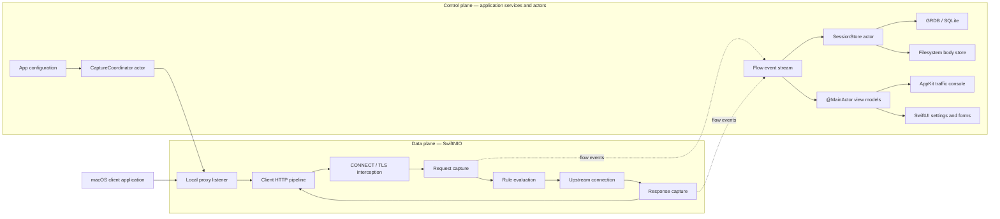

# ProxyLens architecture

**Status:** Recommended architecture
**Scope:** macOS-first native desktop application; complete staged P0/P1/P2 roadmap
**Date:** 2026-08-02

## Architectural decision

ProxyLens should begin as a **modular monolith** using **ports and adapters** with an event-driven proxy pipeline.

The first release should be one native macOS application process. It should not begin with microservices, a hosted backend, a VPN extension, or multiple cooperating processes. The architecture must still isolate the proxy engine, domain model, persistence, macOS integration, and UI so those capabilities can evolve independently.

The architecture has two cooperating parts:

- **Data plane:** latency-sensitive SwiftNIO channels and protocol pipelines that accept, inspect, transform, and forward traffic.
- **Control plane:** Swift actors, application use cases, persistence, rules, configuration, and UI state that coordinate the data plane.

This architecture extends the decisions in [TECH_STACK.md](TECH_STACK.md) and the product scope in [PROXYMAN_FEATURE_INVESTIGATION.md](PROXYMAN_FEATURE_INVESTIGATION.md).

## Runtime architecture



The UI is a consumer of flow snapshots and state changes. It must not be part of the socket-processing path. A slow table refresh must never block a client connection or upstream response.

## Layer boundaries

### Core domain

`ProxyLensCore` contains the concepts the product owns:

- Flows, sessions, requests, responses, headers, timing, and body references.
- Rule definitions, matchers, phases, actions, and rule traces.
- Identifiers and typed errors.
- Ports that describe required capabilities without selecting an implementation.

The core may use Foundation value types where useful, but it must not import AppKit, SwiftUI, SwiftNIO, GRDB, or macOS-specific UI frameworks.

### Application layer

`ProxyLensApplication` contains use cases and orchestration:

- Start and stop capture.
- Pause and resume flows.
- Apply the active rule set.
- Persist flow events.
- Manage sessions and saved filters.
- Replay captured requests and persist the resulting flows.
- Export requests and responses.
- Coordinate the proxy engine, storage, certificate provider, and system proxy controller.

The application layer depends on core protocols. It does not construct concrete NIO channels, SQLite connections, or AppKit views.

### Infrastructure adapters

Infrastructure implements core ports:

- `ProxyLensCapture` implements the network proxy using SwiftNIO.
- `ProxyLensPersistence` implements flow/session/body storage using GRDB, SQLite, and the filesystem.
- `ProxyLensPlatform` implements Keychain, certificate, system proxy, logging, and other macOS integration.

Adapters may depend on the core, but the core must not depend on adapters.

### Application UI

`ProxyLensApp` contains the native macOS application and composition root:

- SwiftUI application shell, onboarding, settings, and forms.
- AppKit traffic console, flow table, outline, inspector, and keyboard behavior.
- `@MainActor` view models.
- Dependency construction and lifecycle wiring.

The UI invokes application use cases and observes immutable state. It does not call GRDB, Keychain, or NIO directly.

## Dependency direction

```text
ProxyLensApp
    ├── ProxyLensApplication
    ├── ProxyLensCapture
    ├── ProxyLensPersistence
    └── ProxyLensPlatform

ProxyLensApplication ──> ProxyLensCore
ProxyLensCapture ───────> ProxyLensCore
ProxyLensPersistence ──> ProxyLensCore
ProxyLensPlatform ─────> ProxyLensCore

ProxyLensCore ─────────> Foundation and Swift standard library only
```

The dependency graph must remain acyclic. `CompositionRoot.swift` is the only place that should know how the concrete adapters are assembled.

## Recommended repository structure

The package boundaries below are local Swift packages. They do not need to be published independently. Their purpose is to make dependencies visible and keep protocol code testable.

```text
ProxyLens/
├── ProxyLens.xcodeproj
│
├── ProxyLensApp/
│   ├── App/
│   │   ├── ProxyLensApp.swift
│   │   ├── AppDelegate.swift
│   │   ├── AppEnvironment.swift
│   │   └── CompositionRoot.swift
│   │
│   ├── UI/
│   │   ├── Shell/
│   │   │   ├── MainWindowController.swift
│   │   │   └── WorkspaceViewModel.swift
│   │   ├── TrafficConsole/
│   │   │   ├── TrafficConsoleViewController.swift
│   │   │   ├── FlowOutlineViewController.swift
│   │   │   ├── FlowTableViewController.swift
│   │   │   ├── FlowTableDataSource.swift
│   │   │   ├── InspectorViewController.swift
│   │   │   └── TrafficConsoleViewModel.swift
│   │   ├── Settings/
│   │   ├── Onboarding/
│   │   └── Components/
│   │
│   └── Resources/
│
├── Packages/
│   ├── ProxyLensCore/
│   │   ├── Package.swift
│   │   ├── Sources/ProxyLensCore/
│   │   │   ├── Domain/
│   │   │   │   ├── Flow/
│   │   │   │   │   ├── Flow.swift
│   │   │   │   │   ├── FlowID.swift
│   │   │   │   │   ├── FlowState.swift
│   │   │   │   │   └── FlowSummary.swift
│   │   │   │   ├── Message/
│   │   │   │   │   ├── HTTPRequest.swift
│   │   │   │   │   ├── HTTPResponse.swift
│   │   │   │   │   ├── HTTPHeaders.swift
│   │   │   │   │   └── BodyReference.swift
│   │   │   │   ├── Session/
│   │   │   │   │   ├── Session.swift
│   │   │   │   │   └── SessionID.swift
│   │   │   │   ├── Timing/
│   │   │   │   │   └── FlowTiming.swift
│   │   │   │   └── Rules/
│   │   │   │       ├── Rule.swift
│   │   │   │       ├── Matcher.swift
│   │   │   │       ├── RulePhase.swift
│   │   │   │       ├── RuleAction.swift
│   │   │   │       └── RuleTrace.swift
│   │   │   ├── Ports/
│   │   │   │   ├── ProxyEngine.swift
│   │   │   │   ├── RequestReplayClient.swift
│   │   │   │   ├── FlowStore.swift
│   │   │   │   ├── BodyStore.swift
│   │   │   │   ├── CertificateProvider.swift
│   │   │   │   ├── CertificateTrustStore.swift
│   │   │   │   └── SystemProxyController.swift
│   │   │   └── Errors/
│   │   │       └── ProxyLensError.swift
│   │   └── Tests/ProxyLensCoreTests/
│   │
│   ├── ProxyLensApplication/
│   │   ├── Package.swift
│   │   ├── Sources/ProxyLensApplication/
│   │   │   ├── CaptureCoordinator.swift
│   │   │   ├── FlowEventBus.swift
│   │   │   ├── RuleEngine.swift
│   │   │   ├── SessionService.swift
│   │   │   ├── CertificateTrustService.swift
│   │   │   ├── ReplayService.swift
│   │   │   └── ExportService.swift
│   │   └── Tests/ProxyLensApplicationTests/
│   │
│   ├── ProxyLensCapture/
│   │   ├── Package.swift
│   │   ├── Sources/ProxyLensCapture/
│   │   │   ├── CaptureEngine.swift
│   │   │   ├── Listener/
│   │   │   │   └── ProxyListener.swift
│   │   │   ├── HTTP/
│   │   │   │   ├── ClientHTTPPipeline.swift
│   │   │   │   ├── HTTPRequestHandler.swift
│   │   │   │   ├── HTTPResponseHandler.swift
│   │   │   │   └── BodyRecorder.swift
│   │   │   ├── Connect/
│   │   │   │   └── ConnectTunnelHandler.swift
│   │   │   ├── Upstream/
│   │   │   │   └── UpstreamConnection.swift
│   │   │   ├── Replay/
│   │   │   │   └── NIORequestReplayClient.swift
│   │   │   ├── TLS/
│   │   │   │   └── TLSChannelConfiguration.swift
│   │   │   └── WebSocket/
│   │   │       └── WebSocketFrameHandler.swift
│   │   └── Tests/ProxyLensCaptureTests/
│   │
│   ├── ProxyLensPersistence/
│   │   ├── Package.swift
│   │   ├── Sources/ProxyLensPersistence/
│   │   │   ├── Database/
│   │   │   │   ├── DatabaseController.swift
│   │   │   │   └── DatabaseConfiguration.swift
│   │   │   ├── Migrations/
│   │   │   │   └── SchemaMigrations.swift
│   │   │   ├── Repositories/
│   │   │   │   ├── FlowRepository.swift
│   │   │   │   └── SessionRepository.swift
│   │   │   ├── Bodies/
│   │   │   │   └── FileBodyStore.swift
│   │   │   └── SessionStore.swift
│   │   └── Tests/ProxyLensPersistenceTests/
│   │
│   └── ProxyLensPlatform/
│       ├── Package.swift
│       ├── Sources/ProxyLensPlatform/
│       │   ├── TLS/
│       │   │   ├── CertificateAuthority.swift
│       │   │   ├── LeafCertificateProvider.swift
│       │   │   ├── KeychainStore.swift
│       │   │   └── SystemCertificateTrustStore.swift
│       │   ├── SystemProxy/
│       │   │   ├── SystemProxyController.swift
│       │   │   └── SavedProxyConfiguration.swift
│       │   ├── Logging/
│       │   │   └── ProxyLensLogger.swift
│       │   └── LoginItems/
│       │       └── LoginItemController.swift
│       └── Tests/ProxyLensPlatformTests/
│
├── Tests/
│   ├── ProxyLensIntegrationTests/
│   └── ProxyLensUITests/
│
├── docs/
│   ├── ARCHITECTURE.md
│   ├── TECH_STACK.md
│   ├── DISTRIBUTION.md
│   └── PROXYMAN_FEATURE_INVESTIGATION.md
│
├── scripts/
│   ├── quality.sh
│   ├── package.sh
│   └── notarize.sh
│
└── .github/
    └── workflows/
```

The initial implementation does not need every directory above. Create the P0 files as their features are implemented. The structure is a dependency map, not a requirement to create empty folders in advance.

## Module responsibilities

| Module | Owns | Must not own |
| --- | --- | --- |
| `ProxyLensCore` | Domain types, rule model, ports, typed errors | NIO, GRDB, AppKit, SwiftUI, Keychain implementation |
| `ProxyLensApplication` | Use cases, orchestration, flow events, rule execution coordination | Socket handlers, SQL queries, view controllers |
| `ProxyLensCapture` | Listeners, NIO channels, HTTP/1.1, CONNECT, TLS pipelines, WebSockets | SQLite, Keychain mutation, UI state |
| `ProxyLensPersistence` | GRDB database, migrations, repositories, body files, session actor | Protocol parsing, AppKit, rule UI |
| `ProxyLensPlatform` | Keychain, CA material, system proxy configuration, logging, isolated JavaScript execution, future helpers | Flow presentation, protocol parsing, product use cases |
| `ProxyLensApp` | Composition root, SwiftUI, AppKit, view models, menus, commands | Direct database or socket access |

## Composition root

`CompositionRoot.swift` is the only place that assembles concrete implementations.

Conceptually:

```swift
let certificateProvider = KeychainCertificateProvider(...)
let bodyStore = FileBodyStore(...)
let sessionStore = GRDBSessionStore(...)
let proxyEngine = NIOProxyEngine(
    certificateProvider: certificateProvider
)
let systemProxy = MacOSSystemProxyController(...)

let coordinator = CaptureCoordinator(
    proxyEngine: proxyEngine,
    sessionStore: sessionStore,
    bodyStore: bodyStore,
    systemProxy: systemProxy
)
```

The actual types may change, but the dependency direction should not. UI view models receive application services or read-only state streams; they do not construct adapters.

## Core domain model

The domain model should represent a captured flow without depending on how it was captured or stored.

```text
Session
└── Flow
    ├── FlowID
    ├── Source
    ├── Request
    │   ├── method
    │   ├── URL
    │   ├── headers
    │   └── BodyReference
    ├── Response?
    │   ├── status
    │   ├── headers
    │   └── BodyReference?
    ├── Timing
    ├── ConnectionInfo
    ├── RuleTrace
    └── FlowState
```

Important rules:

- `Flow` contains metadata and references, not necessarily all body bytes in memory.
- `BodyReference` identifies raw data, its size, encoding, hash, and storage location.
- A body can be inline for small payloads or file-backed for large payloads.
- Hex, native image thumbnails, decoded JSON, XML, form, GraphQL, and Protobuf views are bounded
  derived values. The Protobuf view activates only for declared Protobuf, native gRPC, or gRPC-Web
  media types and never replaces the captured bytes. It can render schema-less wire values or apply
  an explicitly selected message schema from a locally imported, bounded `FileDescriptorSet`
  catalog. Explicit `delimited=true` bodies decode varint-length-prefixed message sequences. Native
  gRPC applies `grpc-encoding` separately from whole-body HTTP `Content-Encoding`; binary/text
  gRPC-Web decodes data and terminal trailer frames, including independently padded text chunks.
  Complete binary WebSocket messages can be explicitly rendered as Protobuf after bounded
  fragmentation reconstruction and negotiated `permessage-deflate` decoding, using the request
  schema for client-to-server traffic and the response schema for the opposite direction. Hex keeps
  showing the authoritative bytes of the selected frame.
- GraphQL inspection accepts JSON request envelopes and `application/graphql` source, formats
  operations and variables for display, and never replaces the authoritative request body.
- Capture derives only the bounded GraphQL operation kind/name into `HTTPRequest` metadata. This
  keeps operation discovery available for external bodies, persistence, search, filtering, and the
  flow-table Query column without loading file-backed payloads. The same metadata powers
  deterministic operation kind/name matching in request-body rules. Malformed, truncated, or
  oversized bodies simply omit the metadata and retain their raw bytes.
- A decoder failure must never make the raw body unavailable.
- A partially captured flow is a valid persisted state with an explicit completion/error status.
- `ConnectionInfo` keeps client-facing destination metadata plus optional observed upstream HTTP
  version and connection-reuse state. The optional fields preserve decoding of older snapshots and
  must never be inferred for imports or transports that did not observe them.

Avoid an enormous `Models` directory. Group models by domain concept so the owner and lifecycle of each type are clear.

## Capture lifecycle

An HTTP/HTTPS flow follows this sequence:

1. `ProxyListener` accepts a client connection.
2. The initial client pipeline parses an HTTP/1.1 forward request or `CONNECT` authority.
3. For `CONNECT`, the tunnel handler establishes TLS interception and ALPN selects downstream
   HTTP/2 or HTTP/1.1 after the handshake.
4. HTTP/2 installs a bounded connection multiplexer; every stream receives the NIO HTTP/2-to-HTTP/1
   codec plus a fresh shared proxy handler. HTTP/1.1 installs the existing connection pipeline.
5. A flow is created with a stable `FlowID` and start time.
6. Request metadata is emitted as an event.
7. Request-phase rules are evaluated.
8. The request body is streamed, recorded, or temporarily buffered according to the active rules.
9. The upstream transport is acquired and the request is forwarded. Eligible HTTPS requests share
   an HTTP/2 origin connection scoped to the proxy event loop. Origins that negotiate HTTP/1.1 use
   the existing dedicated connection path after one cached ALPN probe per capture run. The flow
   records the observed upstream version and whether the HTTP/2 parent was new or reused.
10. Response metadata and body bytes are captured.
11. Response-phase rules are evaluated.
12. The response is forwarded to the originating HTTP/1.1 connection or HTTP/2 stream.
13. The completed flow and raw body references are persisted.
14. The UI receives a final flow snapshot and refreshes derived views.

The default path should stream and tee data into the body store. Buffer only when a breakpoint, body transformation, decoder, or replay operation requires complete content. Large bodies must not force the entire flow into memory.

**TLS interception policy.** `HTTPProxyHandler.receiveConnectHead` and
`SOCKS5ServerHandler.installTLSPipeline` each read a `TLSInterceptionPolicySource`
(`MutableTLSInterceptionPolicy` in production) synchronously on the event loop before minting a
leaf certificate. A host the policy excludes is not intercepted: the handler answers
`200 Connection Established` (or, on SOCKS5, sends nothing further — the CONNECT reply already
went out), dials the origin with no TLS or HTTP handlers, and splices the two channels through
the shared `TunnelPassthrough.splice`, which both handlers call with a protocol-specific
`prelude` (HTTP CONNECT removes its plaintext HTTP handlers and writes the 200 response; SOCKS5
has nothing left to write). The tunnel is recorded as a single `CONNECT` flow
(`TunnelPassthrough.makeFlow`) with `ConnectionInfo.tlsIntercepted == false`; its payload is
never parsed or stored. Policy edits apply to the next tunnel; established tunnels keep their
decision.

### Reverse proxy listener ownership

Reverse Proxy is capture configuration, not a rule action. `ProxyConfiguration` carries a bounded,
validated list of routes from numeric loopback endpoints to HTTP or HTTPS base URLs. On start,
`NIOProxyEngine` creates the ordinary forward listener and each enabled reverse listener on the same
event-loop group. The start is atomic: if any listener cannot bind, the engine closes all listeners
already opened, closes the upstream HTTP/2 pool, shuts down the group, and publishes a failed state.
Stop closes every listener before ending the event-loop group.

Each reverse child channel installs the normal HTTP pipeline with an immutable route snapshot and a
distinct `FlowSource`. It accepts origin-form HTTP requests, rejects `CONNECT`, resolves the raw
target against the configured base path, and then enters the same rules, scripting, body capture,
WebSocket, SSE, breakpoint, throttling, and upstream transport paths as forward traffic. The
resolved URL is the logical destination: its host supplies upstream `Host`, TLS SNI, certificate
validation, HTTP/2 pool identity, capture metadata, and exports. Client headers and raw target stay
available as authoritative captured input. DNS Spoofing may still choose a separate physical socket
address without changing that logical identity.

The `@MainActor` route store owns the versioned local configuration document. UI changes are allowed
only while capture is stopped or failed, and a validated route snapshot is injected into the next
capture start. Listener addresses remain loopback-only to avoid silently exposing an unauthenticated
debugging proxy to the LAN; local TLS termination, LAN exposure, dynamic routing, and load balancing
require separate security and lifecycle specifications.

### SOCKS5 listener ownership

SOCKS5 is optional capture configuration, not a rule or a macOS system-proxy replacement.
`ProxyConfiguration` carries one numeric-loopback endpoint and the same listener validation rejects
collisions with the ordinary forward proxy and enabled reverse routes. `NIOProxyEngine` binds the
SOCKS5 channel between the forward and reverse listeners and includes it in the same start rollback
and stop lifecycle.

Each SOCKS child channel starts with an event-loop-confined, 512-byte bounded negotiation handler.
It accepts only version 5, no-auth CONNECT with IPv4, IPv6, or domain destinations. Once the CONNECT
reply is sent, the handler preserves coalesced bytes and classifies the first application prefix as
HTTP/1.x or a TLS ClientHello. Plain HTTP installs the shared HTTP pipeline against the requested
destination. TLS obtains a leaf identity for that destination and installs the same negotiated
HTTP/1.1 or HTTP/2 interception pipeline used after ordinary CONNECT. Unsupported application
protocols close rather than being misrepresented as HTTP flows.

SOCKS framing is transport metadata and never becomes an HTTP body. The requested destination stays
the logical URL, `Host`, SNI, certificate-validation, rule, connection-pool, and capture identity;
successful HTTP/TLS traffic inherits the existing authoritative raw-byte, body-bound, persistence,
WebSocket, SSE, scripting, breakpoint, and throttling paths. A distinct `FlowSource` labels it
`SOCKS5 Proxy`. The `@MainActor` listener store persists a versioned disabled-by-default preference,
and the native Listeners sheet permits changes only while capture is stopped or failed.

### External HTTP proxy routing

An external HTTP proxy is capture configuration rather than a rule action. `ProxyConfiguration`
carries one optional validated `ExternalHTTPProxyConfiguration`: a bounded hostname or IP literal, a
port, an optional username, and at most 128 normalized bypass entries that match an exact host or a
leading `*.` suffix. That configuration is non-secret and never carries the password. The password
lives only behind the `ExternalHTTPProxyCredentialStoring` port, implemented in `ProxyLensPlatform`
by a Keychain-backed store. `NIOProxyEngine` resolves credentials once during start, builds an
immutable `ExternalHTTPProxyRoute`, and fails the start closed when an enabled configuration cannot
produce the credentials it declares. Handlers then read that `Sendable` route on their own event
loop and never touch the store.

Routing is decided per destination. `shouldProxy(host:)` keeps disabled and bypassed destinations on
the existing direct path, including its HTTP/2 pooling. Plain HTTP and `ws://` connect to the proxy
and rewrite the request target into absolute form while the origin `Host` header and the captured
request stay authoritative. HTTPS and `wss://` open a bounded HTTP/1.1 CONNECT handshake through
`HTTPUpstreamProxyConnectHandler` — at most 32 KiB of response headers, no response body, and a
required 2xx status — then negotiate and verify TLS to the logical destination before the ordinary
interception pipeline is installed. Optional Basic credentials produce one transport-owned
`Proxy-Authorization` header on the proxy request or the CONNECT handshake; any client-supplied
value is removed first, the header never enters captured request metadata, and credentials are
redacted from descriptions and excluded from localized errors. DNS Spoofing keeps its physical
authority for the socket and the CONNECT target while `Host`, SNI, certificate validation, rules,
capture, replay, and export retain the logical host. Proxied TLS uses the existing HTTP/1.1 upstream
path in this increment.

## Concurrency and ownership

SwiftNIO and Swift Concurrency have different ownership models. The boundary must be explicit.

```text
NIO event loop
    └── owns channel and handler state for one connection

CaptureCoordinator actor
    └── owns capture lifecycle and active configuration

SessionStore actor
    └── owns persistence commands and body-file lifecycle

AsyncSequence flow events
    └── carries immutable snapshots or deltas to consumers

@MainActor view models
    └── own selection, sorting, filtering, and presentation state
```

Rules:

- Never mutate SwiftUI or AppKit state from an NIO handler.
- Never run blocking SQLite, filesystem, certificate, or decoder work on an NIO event loop.
- Individual NIO channel state belongs to its event loop; `CaptureCoordinator` owns lifecycle decisions, not mutable channel internals.
- Use immutable rule snapshots for connections. Changes to rules should apply at a defined phase or to new connections.
- Coalesce UI updates when traffic is high, but do not silently discard captured data from storage.
- Use typed cancellation and timeout errors rather than treating every connection close as an application crash.

SwiftNIO's official model is based on event loops, channels, handlers, and channel pipelines. Its `NIOEmbedded` facilities are appropriate for protocol tests without real sockets: [SwiftNIO](https://github.com/apple/swift-nio).

### HTTP/2 stream ownership

`ProxyLensCapture` owns HTTP/2 transport details. Intercepted server TLS advertises `h2` before
`http/1.1`, and the ALPN result installs exactly one connection-level pipeline. The HTTP/2 parent
channel owns frame parsing, HPACK state, flow-control windows, and a maximum of 100 concurrent
streams with a 16 KiB header-list limit. Each stream channel owns one `HTTPProxyHandler`, one flow
transaction, and one independent upstream request stream or dedicated HTTP/1.1 fallback channel.
Closing a downstream stream ends only that flow and its upstream request stream; closing the
downstream parent tears down every child through NIO lifecycle propagation.

The HTTP/2-to-HTTP/1 codec consumes pseudo-headers and translates ordinary request/response parts.
The shared conversion boundary strips hop-by-hop fields before upstream forwarding and records the
client-facing request and response version independently of the upstream wire protocol. App,
application, persistence, and UI layers continue to receive ordinary immutable flow snapshots and
do not depend on HTTP/2 channel types.

One engine-owned `HTTP2UpstreamConnectionPool` retains at most one active parent per normalized
HTTPS origin and proxy event loop. Concurrent first-use requests share a single negotiation future;
the `h2` branch installs a client multiplexer and one codec/response-handler pair per stream. The
`http/1.1` branch closes its one-time probe, caches the result for the capture run, and routes
waiting and later requests through the dedicated HTTP/1.1 connector. Parent close removes only its
matching entry, and engine stop closes every parent/probe before shutting down the event-loop group.
The request that initiates a new negotiation is marked as a new connection; requests that join its
future or acquire an active parent are marked reused. Cached HTTP/1.1 fallback is protocol knowledge,
not socket reuse, because that connector still opens one dedicated channel per request.
WebSocket upgrades bypass this pool. Cleartext h2c, server push, origin coalescing, and RFC 8441
extended `CONNECT` require separate specifications because they change authority or stream
ownership.

### Logical and physical upstream identity

`ProxyTarget.host` remains the logical authority used by the captured URL, HTTP `Host` header, TLS
SNI, certificate validation, rules, and exports. A separate `connectionHost` is the physical socket
destination. Connection-phase DNS Spoof rules are evaluated after request target rewrites and
before an upstream channel is opened; the first matching enabled rule supplies a validated IPv4 or
IPv6 literal without changing the logical authority.

HTTP/1.1 and WebSocket bootstraps connect to `connectionHost`, while upstream TLS still uses the
logical host. Every upstream TLS site reads its server name from `ProxyTarget.tlsServerName`, which
is the logical host for a named destination and `nil` for a bare IP literal, since RFC 6066 forbids
an IP address in SNI. A spoofed destination therefore keeps offering and verifying its logical name
even though the socket goes to the literal. The HTTP/2 pool key contains the logical scheme/host/port and the physical
destination, preventing requests with different routing decisions from sharing a parent channel.
Flow connection metadata deliberately records the logical upstream host so inspection, persistence,
search, and export do not expose transport routing as request identity. Invalid profile data fails
closed during decoding, and the feature never mutates macOS DNS or trust configuration.

## UI architecture

### SwiftUI

Use SwiftUI for:

- Application shell and onboarding.
- Preferences and proxy configuration.
- Certificate trust guidance.
- Rule editor forms.
- Empty states, alerts, and status banners.

### AppKit

Use AppKit for the traffic workspace:

- Nested `NSSplitViewController` instances for a full-height source sidebar beside a request list stacked above an inspector with side-by-side request and response panes.
- `NSOutlineView` for grouping by source, host, or domain.
- `NSTableView` for sortable flows and high-volume updates.
- `NSTextView` for raw request/response editing and replay.
- Native responder-chain commands and keyboard shortcuts.

Source List visibility is owned by the AppKit split-view controller and restored from a local
`UserDefaults` preference at launch. Pinned domain identifiers use the same local-preference
boundary; the traffic view model projects them into every snapshot so a pin remains visible with a
zero-flow count after the current session is cleared.

Saved Custom Filters use that same UI-preference boundary. Each bounded, versioned preset owns one
complete `TrafficDisplayFilter` value and a stable local identifier. The traffic view model applies
the value in one update through `TrafficConsoleStore`, which keeps source selection independent and
drops only flow selections hidden by the resulting projection. Malformed or future-version
preference documents fail closed and never affect captured session data.

The main traffic window should be managed by `MainWindowController`. SwiftUI views can be hosted inside auxiliary windows or panels without making the traffic table depend on SwiftUI rendering behavior.

UI view models should be thin:

```text
FlowEventStream
        ↓
TrafficConsoleViewModel (@MainActor)
        ↓
FlowTableDataSource / InspectorViewModel
        ↓
AppKit views
```

The view model may maintain a display projection for sorting and grouping. It hydrates that projection from `SessionService` on launch and retains the body store for inspection and export.

The flow table uses native multiple selection. The store keeps the complete selected-ID set in the current visible order plus one primary flow for the inspector. Sorting preserves the selection; source or filter changes drop only selections that are no longer visible and promote the first remaining row when the primary flow disappears. Context-clicking outside the current selection selects only that row, while context-clicking within the selection keeps the batch intact.

The single-flow context menu groups clipboard actions under **Copy**: URL, request/response
headers, request/response bodies, request/response cookies, and cURL. Items whose source data is
absent are disabled. Body copying reads the authoritative body reference through
`TrafficBodyReading`, applies supported bounded content decoding for text, and falls back to base64
for binary bytes; it never copies potentially stale inspector text.

A captured row can open a native request-code sheet. `ExportService` loads the authoritative
request body once, caps interactive generation at 8 MiB, and derives cURL, HTTPie, JavaScript
`fetch`, Axios, Python `requests`, Swift `URLSession`, Go `net/http`, and Java `HttpClient`
representations without mutating the flow.
Text bodies use escaped language literals; binary bodies use base64 reconstruction. Generated
clients omit hop-by-hop and automatically recalculated length headers. The AppKit sheet owns only
language selection, syntax presentation, and clipboard copying.

Exactly two selected rows can open a native side-by-side comparison sheet. The view model loads
the immutable flow snapshots and their bodies through `TrafficBodyReading`; it never reads a body
from an inspector view. Text decoding and body reads are limited to 1 MiB per message, and the
line-alignment algorithm caps its LCS matrix before falling back to positional comparison. The UI
uses aligned line numbers, synchronized scrolling, and distinct removal/addition backgrounds while
leaving the captured request and response bytes unchanged.

The bottom inspector exposes Content, Rules, and Timing modes. Request and response section
selectors retain complete labels at usable widths and independently switch to compact native menus
when their pane cannot fit the full segmented control; the selector never widens one message pane
or truncates every label to fragments. Timing is a derived native
waterfall built only from persisted `FlowTiming` milestones: request headers/body, upstream
connect, TLS handshake, first-byte waiting, response body, and finalization. Its scale uses the
latest captured milestone for live or incomplete flows, and it omits phases whose endpoints were
not captured instead of estimating them. A compact Connection summary derives the client protocol
from the captured request and reads optional upstream protocol/reuse facts from `ConnectionInfo`;
missing facts render as Unknown rather than being estimated. DNS timing and a zoomable cross-flow
chart require additional capture instrumentation and remain separate increments.

Compose Request, Repeat Request, and Edit & Repeat are explicit control-plane actions.
`ReplayService` sends the composed, captured, or edited request through the core
`RequestReplayClient` port, persists the returned flow in the current workspace session, and
exposes it to the traffic console as a new `.replay` source. A composed request requires an
absolute HTTP or HTTPS URL because it has no captured request from which to infer an upstream.
When the workspace is empty, `SessionService` creates a stopped local session to own the new flow.
The editor accepts a request line, headers, and UTF-8 body text. Captured gzip, x-gzip, and
deflate text bodies are decoded for editing and re-encoded before replay; unsupported captured
encodings remain unchanged. A composed body may use identity, gzip, x-gzip, or deflate encoding.
Compose Request can also import a cURL command from the clipboard. The bounded application-layer
parser accepts common browser and API-client exports, including request method, URL, repeated
headers, cookies, user agent, referer, HTTP/1.x selection, and text/JSON data. It tokenizes quotes
and line continuations locally; it never invokes a shell or reads referenced files. File-backed
data, cookie/header files, uploads, multipart forms, URL-encoded data helpers, binary escapes, and
unknown behavior-changing options are rejected with an editable error instead of being guessed.
Both stored and decoded body loading are capped at 1 MiB, and edits are checked against the same
limit before sending. Binary and larger bodies remain unchanged. The SwiftNIO adapter connects
directly to the selected HTTP or HTTPS upstream, verifies TLS, strips hop-by-hop headers,
recomputes `Host` and `Content-Length`, does not follow redirects, rejects truncated or oversized
request bodies, bounds captured response bytes, and fails idle responses after 30 seconds. Active
rules are not re-evaluated for replays.

The compose sheet also exposes local presets and recent history. `TrafficRequestComposerStoring`
persists only bounded UTF-8 request text in UserDefaults, caps history and preset counts, updates
presets by case-insensitive name, and records history only after a composed request succeeds. Raw
captured bodies and session data remain in the authoritative session store; composer history is a
convenience cache and can be cleared independently.

## Persistence architecture

`ProxyLensPersistence` should expose application-level operations, not raw SQL to the rest of the app.

Recommended responsibilities:

- `DatabaseController` opens the database and applies migrations.
- `SessionRepository` creates, closes, and loads sessions.
- `FlowRepository` writes flow metadata and queries visible flow summaries.
- `FileBodyStore` writes and reads raw payload files.
- `SessionStore` actor serializes storage commands and coordinates database/file operations.

SQLite should store searchable metadata, headers, timing, body references, rule traces, annotations, and indexes. Large request/response bodies, WebSocket frames, and derived Server-Sent Event data should be stored as managed files. GRDB is the persistence adapter; domain code should depend on `FlowStore` and `BodyStore` protocols instead.

WebSocket capture follows the same metadata/payload split. The NIO upgrade bridge relays frames on
their channel event loops, emits immutable frame snapshots through `WebSocketFrameEventSink`, and
serializes persistence without blocking those loops. GRDB stores frame direction, opcode, flags,
sequence, time, and payload references while `FileBodyStore` owns larger payload bytes. The AppKit
inspector subscribes through an application-layer event bus, keeps only the latest 500 frame rows
in its live presentation, and loads bounded same-direction history lazily. Auto and Protobuf derive
the complete message containing the selected data frame across continuation frames and interleaved
control frames. A Core decoder validates the RFC 6455 sequence and accepted RFC 7692
`permessage-deflate` parameters, rebuilds directional compression context when required, and bounds
frame count plus compressed input, history output, and displayed output. Invalid, incomplete,
truncated, or over-limit messages stay available as exact selected-frame Hex. Direction filtering
remains metadata-only. Payload search reads at most 8 MiB per query and skips individual
payloads above 256 KiB, reporting skipped frames instead of allowing an unbounded inspector task.
Export loads the complete persisted flow history and streams a versioned JSON document through an
atomic staging file; text payloads use UTF-8 and binary or invalid UTF-8 payloads use base64.
Captured bytes and stored payload references remain authoritative.

Live WebSocket composition crosses the existing module boundaries through
`WebSocketFrameTransmitter`. `WebSocketComposeService` validates and bounds UTF-8 or Base64 input in
the application layer, while the capture adapter keeps a registry of currently open upgraded
channels. A transmission is scheduled on the owning NIO event loop, uses client masking only when
sent toward the upstream server, and is recorded through the same frame event and persistence path
as relayed traffic. The UI can query availability but never retains a channel.

Historical WebSocket reconnect uses the transport-neutral `WebSocketConnectionClient` port through
the same application service. `NIOWebSocketConnectionClient` owns an event-loop group independent of
proxy capture, validates a fresh HTTP/1.1 upgrade, uses normal hostname/TLS verification for
`wss://`, and publishes the upgrade as a separate `.replay` flow. Transport-owned headers are
rebuilt, client frames are masked, Ping receives a captured Pong, and peer/user Close frames are
captured before the bounded handshake completes. The native Reconnect editor seeds only validated
headers and an optional complete bounded reconstructed message; Connect & Replay always targets the
upstream server. The original flow stays immutable, the fresh flow remains available to Compose and
Disconnect, and application termination closes all client channels before shutting down their event
loops.

Server-Sent Event capture is a derived path beside authoritative response-body recording. For a
supported `text/event-stream` response, the HTTP bridge feeds each received body chunk through an
identity, gzip, x-gzip, or deflate streaming decoder and then into a bounded incremental parser on
the channel event loop. The decoder supports zlib-wrapped and legacy raw deflate, bounds lifetime
decoded output to the configured response-capture limit, and disables only derived event capture
when input is corrupt, truncated, unsupported, or over budget. Parsed immutable event snapshots cross
`ServerSentEventEventSink`; normalized event data is written asynchronously to `BodyStore`, event
metadata and body references are serialized through `ServerSentEventStore`, and the application
event bus updates the selected inspector. The parser handles stream line endings, an initial UTF-8
BOM, comments, multi-line `data`, `event`, `id`, and valid `retry` fields with 64 KiB line and 1 MiB
event-data limits. The AppKit Events pane keeps only the latest 500 rows, searches at most 8 MiB per
query and 256 KiB per event, lazily formats selected JSON, and exports the complete persisted event
history through an atomic versioned JSON document. A separate application-layer accumulator reads
only that bounded visible history and recognizes OpenAI Chat Completions and Responses API text
deltas. Its derived preview is searchable and copyable, bounds total input to 8 MiB, each event to
256 KiB, and output to 1 MiB, and explicitly reports omitted, ignored, or safety-limited events.
Unknown event schemas are not guessed. Unsupported or stacked content codings, including Brotli,
remain available in Raw/Body views without derived event decoding.

The database should use migrations from the first schema and support recovery from interrupted sessions. A flow that ends during a crash or disconnect should remain inspectable with an explicit incomplete state.

## Rule architecture

Rules are a domain concept with infrastructure-aware execution.

```text
Matcher + phase + action
```

- `Matcher` is deterministic and side-effect-free.
- `RulePhase` identifies connection, request headers, request body, response headers, response body, or WebSocket frame processing.
- `RuleAction` describes map, pause, block, allow, transform, throttle, redirect, DNS routing, or
  annotate behavior.
- `RuleTrace` records which rules matched and what happened. Successful script traces may also
  contain runtime-bounded local log entries; older persisted traces decode with an empty log list.

Keep matching and rule planning in `ProxyLensCore`. Keep file reads, breakpoint waits, and other asynchronous work in `ProxyLensApplication` or an adapter.

The P1 scripting foundation keeps executable code outside both NIO event loops and the GUI process.
`ProxyLensCore` defines bounded, Codable request/result values and a `ScriptExecutor` port.
`ProxyLensPlatform` evaluates one `onRequest(context)` or `onResponse(context)` handler in a fresh
JavaScriptCore context hosted by a short-lived worker mode of the signed app executable. The parent
communicates through owner-only temporary files, validates the result again in Core, and terminates
the worker at a bounded deadline. The worker receives only JSON data and exposes a bounded log
function; it has no native-object, filesystem, network, module, environment, or Keychain bridge.
`RuleAction.script` is planned in request-header, request-body, response-header, and response-body
phases. Header scripts receive metadata with a `nil` body, execute serially away from the NIO event
loop before the corresponding head is forwarded, and may rewrite the method, URL, status, or
ordinary headers. A returned body is rejected, request targets are validated again, and
`Content-Length`, `Transfer-Encoding`, `Content-Encoding`, and `Trailer` remain owned by the native
framing pipeline. WebSocket upgrades use the same header phases: request scripts receive a semantic
`ws://` or `wss://` target and may rewrite that URL plus ordinary request headers; response scripts
may rewrite ordinary `101` response headers. The native upgrade path retains the method, status,
Host, Connection/Upgrade, WebSocket key/version/accept, subprotocol, and extension fields. A script
that changes one of those fields fails open without discarding an earlier valid script mutation.
Request forwarding remains inside the existing pending-request byte bound.
Response auto-read pauses while the worker runs, and already-delivered response parts have their own
1 MiB queue bound before normal backpressure resumes. Body scripts buffer eligible
identity-encoded UTF-8 bodies within both capture and scripting limits. Every phase forwards the
last valid serial mutation. A script failure is fail-open and produces a failed `RuleTrace`; raw
captured request/response bytes remain authoritative. WebSocket upgrades, server-sent event streams,
encoded bodies, invalid UTF-8, and oversized bodies bypass body mutation with an explicit failed
trace. The native Rules window creates and edits all four HTTP script phases with phase-aware
templates, selection-preserving muted JavaScript highlighting, and the runtime's 64 KiB source
validation.
Successful `context.log(...)` output remains attached to its owning `RuleTrace`, survives local flow
persistence, participates in traffic search, and appears under that rule in the selected flow's
Rules inspector. Logs keep the worker's 100-entry and 64 KiB limits and never enter `OSLog`.
Deeper static validation and a standalone streaming console remain future increments.

P0 rules currently implemented in the shared pipeline:

- Block and Allow at request headers, plus operation-aware Block at request body after bounded
  GraphQL discovery. The first matching allow or block terminates later block/allow rules in that
  phase. A request-body block returns the same local 403 response without opening the upstream
  connection.
- No-cache request and response header rewriting.
- Map Local, evaluated during request headers or after bounded request-body discovery. The first
  matching map-local rule serves a preloaded local response and skips the upstream connection.
  Operation-aware GraphQL rules use the request-body phase so a shared endpoint can return a
  fixture selected by operation kind/name. File bytes are loaded in `RuleEngine` and published
  through `MutableRuleSnapshot`; NIO handlers only read the snapshot.
- Map Remote, evaluated during request headers or after bounded request-body discovery. The first
  matching map-remote rule rewrites the upstream scheme, host, port, and path, then connects to that
  destination. Operation-aware GraphQL rules use the request-body phase so different operations on
  one endpoint can map to different upstreams before a connection opens. An origin-only destination
  (`http://host` or `http://host/`) keeps the original path and query; a destination with a path or
  query replaces them. The captured request URL stays client-facing; `ConnectionInfo` is replaced
  with the actual mapped upstream before the request is forwarded. Map Local and Map Remote are
  mutually exclusive: the first matching mapping rule wins.
- Redirect, evaluated during request headers. The first matching rule returns a client-visible
  `307 Temporary Redirect` with an absolute HTTP or HTTPS `Location`, records the local response,
  and skips the upstream connection. Using 307 preserves the original method and body if the client
  follows the redirect. Redirect is mutually exclusive with Block, Map Local, and Map Remote; the
  first terminal rule wins. The flow-table action matches the selected request's host and path.
- Throttle, initially evaluated during request headers. The first matching profile can add bounded
  latency before the upstream connection is opened. The delay is scheduled on the channel event
  loop and never sleeps or blocks that event-loop thread. Upload and download bytes are paced with
  cumulative event-loop deadlines; high/low queue watermarks toggle channel `autoRead` so slow
  profiles cannot grow memory without bound. Flow-table Network Conditions provides removable,
  host-scoped latency-only rules plus Slow 3G, Fast 3G, and Wi-Fi latency/bandwidth presets. A
  native Custom editor accepts bounded latency, download, upload, and request-loss values for
  one-off host profiles. An optional name persists a reusable profile in local preferences; saved
  profiles can be applied to any selected host or removed without affecting existing runtime
  rules. Request loss is sampled deterministically from `FlowID`. A sampled request becomes a
  `.simulatedNetworkFailure` before any upstream connection, preserving HTTP framing and producing
  a truthful failed-flow snapshot and rule trace.
- Replace Body, evaluated during request or response body phases. The first matching replacement
  supplies complete inline bytes. Request replacement forwards those bytes upstream while the
  captured client body stays authoritative. Response replacement suppresses the upstream body sent
  to the client while the original upstream bytes remain authoritative in capture. `RuleEngine`
  preloads selected files with the same 10 MiB rule-file limit used by Map Local. Capture removes
  stale transfer, encoding, range, trailer, and integrity headers, then writes exact
  `Content-Length` and inferred `Content-Type` headers. Bodyless HEAD, informational, 204, and 304
  responses are never replaced. Flow-table actions can match the selected request's host/path or
  its discovered GraphQL kind/name and can coexist with Map Remote and Breakpoint; an edited
  breakpoint response takes precedence over a configured response replacement. Block and Map Local
  still prevent an upstream request.
- Breakpoint, evaluated during request headers, request bodies, response headers, or incoming
  WebSocket data frames. The first matching breakpoint pauses the flow until the user continues or
  aborts. Request-header breakpoints wait until the request is complete, then hold the upstream
  connect. Activating a request-body rule deliberately buffers bounded requests instead of opening
  the upstream connection, allowing GraphQL operation discovery and operation-scoped Block or
  Breakpoint actions before any bytes are forwarded. Response breakpoints buffer the upstream
  response and hold the client write. WebSocket response breakpoints capture the original upstream
  frame first, then pause text, binary, or continuation frames before forwarding. Ping, pong, close,
  and client-to-server frames bypass the pause so protocol liveness is preserved. Only complete,
  uncompressed, valid UTF-8 text payloads up to 1 MiB can be edited; other paused payloads remain
  read-only. Continue can apply edited HTTP start-line, headers, and body text or a safe WebSocket
  payload while preserving opcode, FIN/RSV bits, masking direction, and extension state. Abort
  cancels HTTP flows with a 403 or closes both WebSocket peers and fails the flow. Matching stays in
  `RulePlanner`; `BreakpointCoordinator` owns the wait. NIO handlers hop off the event loop, await
  the decision, then hop back. Block and Map Local skip request breakpoints; Map Remote can still
  pause. Captured HTTP and WebSocket bytes remain authoritative even when forwarded content is
  edited.
- Display/filter matching.

Live rules are published through `MutableRuleSnapshot`, a synchronous `RuleSnapshotSource` that NIO handlers can read on the event loop. `RuleEngine` in `ProxyLensApplication` owns the active `RuleSet` and updates that snapshot. Matching and planning stay in `RulePlanner` inside `ProxyLensCore`. The native Rules sheet projects the ordered live set and can enable, disable, remove, or safely edit representable rules without changing stable rule identity. Its validated rule form creates and edits Block, Allow, Breakpoint, and No Cache rules with action-compatible phases and bounded matcher inputs. Unsupported composite, case-sensitive, or file-backed shapes stay read-only instead of losing data. File-backed mapping and replacement actions remain contextual so resources are validated and preloaded before publication.

`RuleProfile` is a versioned, durable snapshot of the complete live `RuleSet` plus every referenced
`MapLocalSpec`. `FileRuleProfileStore` writes bounded JSON archives atomically under Application
Support, limits storage to 50 profiles and 64 MiB per archive, and updates same-name profiles while
preserving their stable identity and creation date. The Rules sheet can save, apply, and remove
named profiles. Applying validates the schema and all Map Local references before atomically
replacing the published rule set; deleting a profile does not mutate the active rules.
`RuleProfileArchiveService` exports the same complete snapshot as a versioned `.proxylensrules`
JSON document using an atomic file replacement. Import treats the file as untrusted input: it must
be a regular file, remain within the 64 MiB limit, decode as the current schema, contain a bounded
profile name, and provide exactly one embedded resource for every referenced Map Local action
before `FileRuleProfileStore` persists it. Importing the same identity or name updates that local
profile without applying it to live traffic.

P0 application source attribution currently implemented:

- When the listener accepts a local proxy connection, `MacOSFlowSourceResolver` inspects the TCP socket owner with `libproc` and resolves the process to application metadata with AppKit and the process APIs. The scan runs on a dedicated serial utility queue before the HTTP pipeline is installed, so it does not block a SwiftNIO event-loop thread.
- The immutable `FlowSource` stores the display name, bundle identifier, outermost application-bundle path, executable path, process identifier, and client endpoint. Helper processes inside an application bundle group under the outermost host application.
- The source sidebar groups desktop-proxy flows under **Apps**, uses installed application icons when a bundle path is available, and supports selecting an application as a traffic filter. Attribution failures degrade to **Unknown App** without interrupting capture. Imported and replayed flows are not presented as locally attributed applications.
- This is best-effort attribution for explicit local proxy connections. It does not require a privileged helper or `NetworkExtension`, and short-lived sockets or processes hidden by operating-system permissions may remain unknown.

P0 body inspection currently implemented:

- `JSONBodyView` pretty-prints JSON objects and arrays from captured body bytes. `application/json`, `text/json`, and `+json` types are treated as JSON; unlabeled UTF-8 that parses as an object or array is also accepted.
- `HTTPContentCoding` unwraps gzip, x-gzip, and deflate with a bounded decoded size for the derived JSON view and Edit & Repeat. Edited compressed text is re-encoded before replay. Brotli and other encodings stay unsupported. The Body tab, HAR/cURL export, and breakpoint Continue keep the captured bytes.
- The inspector adds read-only Preview, JSON, Tree, XML, Form, Protobuf, Hex, and request-only GraphQL segments next to Headers and Body. Preview uses macOS ImageIO away from the main actor to recognize supported raster formats, decode at most 16 MiB of identity/gzip/deflate content, and produce a first-frame PNG thumbnail no larger than 2,048 pixels on either axis. It reports source format, dimensions, frame count, capture metadata, and explicit truncated/oversized/invalid states; the thumbnail never replaces the captured bytes. Hex always renders the authoritative captured bytes as offset, 16-byte hexadecimal, and printable-ASCII columns, caps output at 64 KiB, and states when more bytes were captured. JSON applies native, presentation-only syntax colors; Tree presents the same derived JSON as an expandable native outline with key/value columns. Tree construction runs away from the main actor and is bounded to 10,000 nodes, 64 levels, and the inspector's existing 1 MiB decoded-body limit; truncation is explicit. XML is pretty-printed only after bounded decoding and parsing with external entities disabled; document type declarations are rejected. Form decoding supports declared URL-encoded and multipart form-data, preserves field order, duplicates, and empty values, and summarizes file parts without rendering their untrusted binary bytes. Multipart boundaries, decoded bodies, and rendered output are bounded; nested multiparts and transfer encodings are not interpreted. GraphQL accepts JSON envelopes and `application/graphql`, formats operations and variables, and exposes operation discovery in the flow list and filters. The Protobuf view recognizes declared Protobuf media types and decodes varint, fixed32, fixed64, string, nested-message, and bounded byte-preview values away from the main actor. Its schema-less representation remains available; importing a compiled `FileDescriptorSet` adds a locally persisted immutable catalog, and each message pane can select its own root type to show field names, declared scalar types, enum labels, nested messages, and packed repeated scalars. The Core parser treats descriptor bytes as untrusted, caps the file at 4 MiB, and bounds files, schema elements, strings, and nesting before publishing the new catalog. Explicit `delimited=true` media-type parameters decode one or more varint-length-prefixed messages. Native `application/grpc` and `application/grpc+proto` bodies follow the official 5-byte message framing, render every bounded message independently, and decode per-message gzip/deflate only when `grpc-encoding` declares it. Binary and text gRPC-Web Protobuf media types decode data frames and terminal HTTP/1-style trailer frames; text mode accepts whole base64 bodies and concatenated independently padded chunks. Compressed gRPC-Web frames are summarized without guessing an encoding. Complete text and binary WebSocket messages expose Auto, Protobuf, and Hex representations; Auto/Protobuf reconstruct fragments and decode negotiated `permessage-deflate` within explicit bounds, explicit Protobuf uses the message direction's selected schema, and Hex keeps the selected frame's raw bytes. Control frames remain individually inspected. Protobuf input and rendered UTF-8 output are each limited to 1 MiB, with at most 10,000 decoded fields or packed elements, 1,000 framed messages, and 16 nested levels. Groups and Google well-known-type presentation remain future work. The inspector also colors HTTP header names/values and all supported structured text. Its Timing mode presents total and first-byte duration plus the captured phase waterfall. The Compose Request and Edit & Repeat windows reuse the same palette, initially pretty-print valid JSON, and refresh body highlighting when either headers or body text changes. Opening and sending an untouched formatted captured body still replays the authoritative captured bytes. A decoder failure leaves the raw body available and shows a reason on the relevant derived view. The shared JSON query surface preserves separate JSONPath and jq drafts for the selected message. JSONPath supports root, object-key, array-index, quoted-key, and wildcard selectors. The jq mode is a side-effect-free Core parser/evaluator for traversal, iteration, pipelines, and scalar `select` comparisons; it never invokes a process. Both derived modes bound input, query complexity, expansion, depth, and rendered output.
- Request and response Cookies segments derive readable cookie pairs and `Set-Cookie` attributes from the captured headers. Multiple header fields remain ordered, cookie values keep embedded equals signs, and the raw headers remain authoritative for export, replay, and breakpoint editing.
- Identity, gzip, x-gzip, and deflate `text/event-stream` responses expose a native Events mode
  with event type, ID,
  retry, timestamp, size, bounded search, lazy JSON/text data inspection, live updates, and complete
  persisted-history export. Its Accumulated mode recognizes bounded OpenAI Chat Completions and
  Responses API text deltas, supports native find and copy, and makes omissions and truncation
  visible. The normalized event payload and accumulated text are derived; the captured response
  body is still the source of truth.

P0 HAR interchange and export currently implemented:

- Copy URL, request/response headers, request/response bodies, request/response cookies, or cURL
  from a single captured flow. Missing values are disabled in the native submenu. Hop-by-hop and
  auto-set headers (`Content-Length`, `Transfer-Encoding`, `Connection`, and related) are omitted
  from cURL. Request body generation uses captured raw bytes from `BodyStore`; direct body copying
  is bounded and uses text when decodable or base64 for binary payloads.
- Export HAR 1.2 for one flow, the current multi-row selection, or every flow in a selected session. Selected-row export follows the visible table order. Session export preserves capture order and includes the complete session even when the table has active filters. Incomplete flows emit `status` 0. Truncation, cancellation, and failure are recorded in `comment`. `ExportService` reads immutable `Flow` snapshots and authoritative body bytes; it does not talk to NIO.
- Whole-session export writes one entry at a time to a sibling staging file, then atomically replaces the destination after the document is complete. This avoids retaining every body in memory and preserves an existing destination when body loading, serialization, cancellation, or file writing fails.
- Import a HAR 1.2 file as a stopped, named offline session from the native **Import…** action. `HARImportService` accepts HTTP and HTTPS entries, preserves ordered duplicate headers, status, timing, HTTP version, UTF-8 text bodies, and base64 bodies, and maps entries without a response to failed flows. The newly imported session and first flow are selected for immediate inspection.
- HAR input is untrusted and bounded before persistence: files are limited to 100 MiB, logs to 10,000 entries, and each represented body to the configured capture-body limit (50 MiB by default). Unsupported versions, URL schemes, header fields, encodings, and invalid base64 fail the import. A partially persisted import is rolled back with its body references.

The traffic console exposes selected-flow export actions on the flow-table context menu, whole-session HAR export on each session's source-list context menu, and HAR or ProxyLens-session import in the workspace header with the Command-O shortcut. Inspector text is never the export source; the selected-flow action follows the current projection, while whole-session export intentionally ignores it.

P1 OpenAPI export currently implemented:

- The flow-table context menu exports one or more selected flows as OpenAPI 3.0 YAML. The
  deterministic document aggregates servers, paths, methods, query parameter names, response
  statuses, and request/response media types across the selection.
- JSON request and response bodies contribute bounded, inferred schemas only; header values and
  body examples are never copied. Body reads are capped at 1 MiB and preserve the raw flow bytes
  as the authoritative source. Empty selections and unsupported methods fail without writing a
  partial destination.

P0 session persistence currently implemented:

- Capture upserts every flow snapshot into `GRDBSessionStore` before the UI sees it. Bodies stay in `FileBodyStore`.
- On launch, `SessionService` hydrates the traffic console with persisted sessions and every persisted flow, oldest first, after capture recovery. Inspection and HAR/cURL work with capture stopped because they read `BodyStore` from those restored `Flow` snapshots.
- The source sidebar presents saved sessions newest first with their recording, stopped, or interrupted state. Selecting a session projects only its flows while preserving the global search and filter controls. Inactive sessions can be renamed or deleted from the native context menu; the active recording session is protected. Capture start and stop refresh the session projection without requiring a relaunch.
- Clear Session stops capture if it is running, empties the console, and deletes every session plus body files. Pending live events are discarded so cleared flows cannot reappear. A new capture can append afterward. Restore failures are shown in the status bar.
- A portable session is a Finder package with the `.proxylens` extension. Version 1 contains `manifest.json`, one bounded metadata record per flow under `flows/`, and separate authoritative request and response bytes under `bodies/`. Export streams flows into a sibling staging package and replaces the destination only after the complete package is durable, so a failed export preserves an existing destination.
- Import treats the package as untrusted input: the root and fixed subdirectories must be real directories rather than symbolic links, metadata and body sizes are bounded, body digests are verified while streaming into `BodyStore`, and any partial import is rolled back. Imported sessions receive fresh session, flow, and body identities, are marked stopped for offline inspection, and can safely be imported more than once. A live snapshot that has not reached a terminal state is exported as an explicit failed offline flow rather than as a permanently recording session.
- Native packages preserve headers, response metadata, timing, annotations, applied rule traces, and raw request/response bytes. They do not yet contain global rule definitions because durable rule profiles are application-owned rather than session-owned; adding profiles to portable package interchange remains separate work.

P1 flow organization currently implemented:

- Local flow annotations persist a normalized comment, one of six highlight colors, and a strikethrough flag in indexed flow columns as well as the encoded snapshot. Annotation updates use a dedicated store operation, and ordinary capture upserts deliberately preserve those columns so a later stale network event cannot erase user metadata. The console can search comments and filter by annotation kind or color.
- Two-flow comparison is derived from immutable snapshots and bounded body reads. The AppKit sheet
  offers synchronized side-by-side panes and a standard unified representation for the selected
  request or response. Copy uses the generated unified text, while export performs one atomic write
  to a user-selected `.diff` destination. Binary, oversized, and unavailable bodies remain explicit
  placeholders rather than being coerced or omitted silently.

P0 HTTPS certificate trust currently implemented:

- `KeychainCertificateProvider` owns CA material. The root private key stays non-extractable and its signing ACL includes the current application. The public certificate is stored as a Keychain certificate item associated by public-key hash so the same CA is reloaded after relaunch. It is not stored as a generic password, because reading that secret prompts for the login keychain on unsigned debug builds. `SystemCertificateTrustStore` is a separate actor so the SecurityAgent password panel cannot stall leaf minting.
- Trust is installed into the user domain with `SecTrustSettingsSetTrustSettings`. The app stays unprivileged; SecurityAgent prompts for the login password. Removal uses `SecTrustSettingsRemoveTrustSettings` and treats a missing setting as success.
- The traffic console reads the root certificate's user-domain trust settings without using the private key. It reports trusted only for an unrestricted root setting. This avoids signing a probe leaf, which would access the root key and could display a Keychain signing prompt during app launch.
- The header button opens a SwiftUI sheet to install trust, save the PEM, or remove trust. The sheet is not shown automatically on launch. A dismissed password panel is treated as cancellation, not a failure.

P0 system proxy configuration currently implemented:

- `MacOSSystemProxyController` creates `SCPreferences` sessions with `SCPreferencesCreateWithAuthorization` and retains one `AuthorizationRef` for its lifetime. An unauthorized session cannot take the write lock: `SCPreferencesLock` fails with `kSCStatusAccessError` for an unprivileged app. macOS may reuse credentials briefly, but the system authorization policy can expire them before a later restore and display another administrator prompt. Avoiding that prompt for long captures requires a separately signed, narrowly scoped privileged helper; retaining the authorization cannot override the system policy.
- Taking the pre-activation snapshot only reads service configuration, so it does not hold the write lock. Applying and restoring proxy settings lock, commit, and apply.

P0 distribution currently implemented:

- Hardened Runtime is enabled. The app is not sandboxed.
- `scripts/package.sh` builds a Release zip and SHA-256 checksum under `dist/`. Default signing is ad-hoc. `PROXYLENS_SIGN_IDENTITY` can supply a Developer ID Application identity later. Apple Development identities are rejected for the zip.
- `scripts/notarize.sh` re-signs, submits with `notarytool`, staples, and rewrites the zip when a Developer ID and notary credentials are present. Without a paid Developer Program membership it exits with setup instructions. GitHub Releases are deferred until then. See [DISTRIBUTION.md](DISTRIBUTION.md).

## Security and platform boundaries

All macOS-specific security behavior belongs in `ProxyLensPlatform`:

- Root CA creation and leaf certificate generation.
- Keychain storage of private keys and certificates.
- Certificate trust guidance or installation via `CertificateTrustStore` / `SystemCertificateTrustStore`.
- System HTTP/HTTPS proxy configuration and restoration.
- Local TCP socket ownership and application metadata attribution.
- OSLog categories and redaction.
- Future login-item or helper-process registration.

The main proxy should remain unprivileged. If a privileged helper becomes necessary, add a separate target later with a narrow XPC interface. Do not let the helper own the entire application or proxy engine.

`NetworkExtension` is intentionally outside P0. It should be introduced only for transparent capture, VPN-based routing, or mobile-device support.

The root CA private key, authorization headers, cookies, request bodies, and full URLs must not appear in normal logs or diagnostics exports. Imported HAR and session files should be treated as untrusted input.

Apple's [Keychain Services](https://developer.apple.com/documentation/security/keychain-services/) should be the boundary for private key material. Certificate construction should remain behind the certificate-provider port.

## Error and backpressure policy

Errors should be visible at the right boundary:

- Protocol errors become flow or connection error states.
- Upstream failures produce an inspectable partial flow when possible.
- Rule failures include the rule identifier and phase.
- Persistence failures are surfaced as diagnostics and do not crash the UI.
- UI update failures cannot interrupt capture.

Backpressure rules:

- Respect NIO channel writability.
- Stream large bodies to files instead of accumulating unbounded memory.
- Bound decoded and decompressed output.
- Apply display throttling only to UI snapshots, never to persisted raw bytes.
- Allow the user to configure retention limits and cleanup behavior.

## Testing structure

Tests should live beside the package they protect, with a small number of end-to-end suites at the repository level.

### Core tests

- Matchers and rule ordering.
- Flow state transitions.
- Header normalization.
- Body-reference semantics.
- Timing calculations.

### Capture tests

Use SwiftNIO embedded channels and local fixtures for:

- Fragmented HTTP headers and bodies.
- CONNECT success and failure.
- TLS handshake failures.
- Client disconnects during streaming.
- Backpressure and timeouts.
- WebSocket upgrades and frames.
- Breakpoint pause/resume.

### Persistence tests

- Fresh database creation.
- Every migration path.
- Concurrent reads and writes.
- Body-file cleanup.
- Crash/restart recovery.
- Search index consistency.

### Integration and UI tests

- Start and stop the local proxy.
- Configure and restore system proxy settings.
- Capture HTTP and HTTPS traffic from a local fixture client.
- Inspect and export a flow offline.
- Configure Map Local/Remote and Breakpoint.
- Verify the traffic console with large flow lists.

Tests must not depend on the public internet.

## P0 implementation order

1. Create the Xcode app and local package boundaries.
2. Implement `ProxyLensCore` flow, message, body-reference, rule, and port types.
3. Implement the HTTP/1.1 listener and forwarding path.
4. Add the certificate provider, Keychain storage, CONNECT, and TLS interception.
5. Implement GRDB migrations, flow metadata, and filesystem body storage.
6. Add `CaptureCoordinator`, `SessionStore`, and the flow event stream.
7. Build the AppKit three-pane traffic console.
8. Add display filters and search.
9. Add Map Local, Map Remote, Breakpoint, Block/Allow, and no-cache rules.
10. Add HAR and cURL export.
11. Restore persisted sessions into the traffic console and clear the workspace.
12. Package a Hardened Runtime Release zip. Notarized GitHub Releases wait on a Developer ID.

P0 had to be reliable before HTTP/2, HTTP/3, Network Extension, mobile capture, scripting, cloud
sync, or team collaboration began. That gate is satisfied for the staged downstream and upstream
HTTP/2 work described above; keep the remaining roadmap work isolated behind explicit milestones
and acceptance tests.

## Architecture rules

These rules should be reviewed whenever a new feature is added:

1. The core domain cannot import UI or infrastructure frameworks.
2. The UI cannot access NIO channels or repositories directly.
3. NIO handlers cannot perform blocking work.
4. Raw bytes must remain recoverable after every transformation.
5. New rules must use the shared matcher/phase/action pipeline.
6. New persistence behavior must go through a port and migration.
7. New macOS permissions or entitlements must be isolated in `ProxyLensPlatform`.
8. A feature is not complete until it has unit, protocol, or integration coverage appropriate to its risk.
9. Avoid generic `Managers`, `Helpers`, and `Utils` folders; name files after domain concepts or use cases.
10. Keep the first release one process unless a security or macOS requirement proves a separate helper necessary.

## Related references

- [TECH_STACK.md](TECH_STACK.md)
- [DISTRIBUTION.md](DISTRIBUTION.md)
- [PROXYMAN_FEATURE_INVESTIGATION.md](PROXYMAN_FEATURE_INVESTIGATION.md)
- [SwiftNIO](https://github.com/apple/swift-nio)
- [GRDB.swift](https://github.com/groue/GRDB.swift)
- [swift-certificates](https://github.com/apple/swift-certificates)
- [Protocol Buffers `MessageLite`](https://protobuf.dev/reference/java/api-docs/com/google/protobuf/MessageLite.html)
- [gRPC over HTTP/2 framing](https://grpc.github.io/grpc/core/md_doc__p_r_o_t_o_c_o_l-_h_t_t_p2.html)
- [gRPC-Web protocol](https://github.com/grpc/grpc/blob/master/doc/PROTOCOL-WEB.md)
- [Apple Keychain Services](https://developer.apple.com/documentation/security/keychain-services/)
- [Apple Network Extension](https://developer.apple.com/documentation/networkextension)
