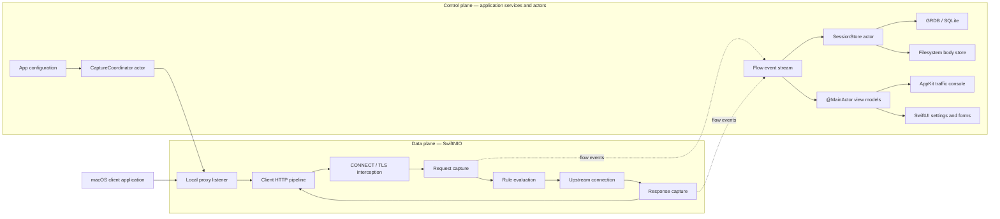

# ProxyLens architecture

**Status:** Recommended architecture
**Scope:** macOS-only native application; desktop proxying first
**Date:** 2026-08-02

## Architectural decision

ProxyLens should begin as a **modular monolith** using **ports and adapters** with an event-driven proxy pipeline.

The first release should be one native macOS application process. It should not begin with microservices, a hosted backend, a VPN extension, or multiple cooperating processes. The architecture must still isolate the proxy engine, domain model, persistence, macOS integration, and UI so those capabilities can evolve independently.

The architecture has two cooperating parts:

- **Data plane:** latency-sensitive SwiftNIO channels and protocol pipelines that accept, inspect, transform, and forward traffic.
- **Control plane:** Swift actors, application use cases, persistence, rules, configuration, and UI state that coordinate the data plane.

This architecture extends the decisions in [TECH_STACK.md](TECH_STACK.md) and the product scope in [PROXYMAN_FEATURE_INVESTIGATION.md](PROXYMAN_FEATURE_INVESTIGATION.md).

## Runtime architecture



The UI is a consumer of flow snapshots and state changes. It must not be part of the socket-processing path. A slow table refresh must never block a client connection or upstream response.

## Layer boundaries

### Core domain

`ProxyLensCore` contains the concepts the product owns:

- Flows, sessions, requests, responses, headers, timing, and body references.
- Rule definitions, matchers, phases, actions, and rule traces.
- Identifiers and typed errors.
- Ports that describe required capabilities without selecting an implementation.

The core may use Foundation value types where useful, but it must not import AppKit, SwiftUI, SwiftNIO, GRDB, or macOS-specific UI frameworks.

### Application layer

`ProxyLensApplication` contains use cases and orchestration:

- Start and stop capture.
- Pause and resume flows.
- Apply the active rule set.
- Persist flow events.
- Manage sessions and saved filters.
- Replay and export requests.
- Coordinate the proxy engine, storage, certificate provider, and system proxy controller.

The application layer depends on core protocols. It does not construct concrete NIO channels, SQLite connections, or AppKit views.

### Infrastructure adapters

Infrastructure implements core ports:

- `ProxyLensCapture` implements the network proxy using SwiftNIO.
- `ProxyLensPersistence` implements flow/session/body storage using GRDB, SQLite, and the filesystem.
- `ProxyLensPlatform` implements Keychain, certificate, system proxy, logging, and other macOS integration.

Adapters may depend on the core, but the core must not depend on adapters.

### Application UI

`ProxyLensApp` contains the native macOS application and composition root:

- SwiftUI application shell, onboarding, settings, and forms.
- AppKit traffic console, flow table, outline, inspector, and keyboard behavior.
- `@MainActor` view models.
- Dependency construction and lifecycle wiring.

The UI invokes application use cases and observes immutable state. It does not call GRDB, Keychain, or NIO directly.

## Dependency direction

```text
ProxyLensApp
    ├── ProxyLensApplication
    ├── ProxyLensCapture
    ├── ProxyLensPersistence
    └── ProxyLensPlatform

ProxyLensApplication ──> ProxyLensCore
ProxyLensCapture ───────> ProxyLensCore
ProxyLensPersistence ──> ProxyLensCore
ProxyLensPlatform ─────> ProxyLensCore

ProxyLensCore ─────────> Foundation and Swift standard library only
```

The dependency graph must remain acyclic. `CompositionRoot.swift` is the only place that should know how the concrete adapters are assembled.

## Recommended repository structure

The package boundaries below are local Swift packages. They do not need to be published independently. Their purpose is to make dependencies visible and keep protocol code testable.

```text
ProxyLens/
├── ProxyLens.xcodeproj
│
├── ProxyLensApp/
│   ├── App/
│   │   ├── ProxyLensApp.swift
│   │   ├── AppDelegate.swift
│   │   ├── AppEnvironment.swift
│   │   └── CompositionRoot.swift
│   │
│   ├── UI/
│   │   ├── Shell/
│   │   │   ├── MainWindowController.swift
│   │   │   └── WorkspaceViewModel.swift
│   │   ├── TrafficConsole/
│   │   │   ├── TrafficConsoleViewController.swift
│   │   │   ├── FlowOutlineViewController.swift
│   │   │   ├── FlowTableViewController.swift
│   │   │   ├── FlowTableDataSource.swift
│   │   │   ├── InspectorViewController.swift
│   │   │   └── TrafficConsoleViewModel.swift
│   │   ├── Settings/
│   │   ├── Onboarding/
│   │   └── Components/
│   │
│   └── Resources/
│
├── Packages/
│   ├── ProxyLensCore/
│   │   ├── Package.swift
│   │   ├── Sources/ProxyLensCore/
│   │   │   ├── Domain/
│   │   │   │   ├── Flow/
│   │   │   │   │   ├── Flow.swift
│   │   │   │   │   ├── FlowID.swift
│   │   │   │   │   ├── FlowState.swift
│   │   │   │   │   └── FlowSummary.swift
│   │   │   │   ├── Message/
│   │   │   │   │   ├── HTTPRequest.swift
│   │   │   │   │   ├── HTTPResponse.swift
│   │   │   │   │   ├── HTTPHeaders.swift
│   │   │   │   │   └── BodyReference.swift
│   │   │   │   ├── Session/
│   │   │   │   │   ├── Session.swift
│   │   │   │   │   └── SessionID.swift
│   │   │   │   ├── Timing/
│   │   │   │   │   └── FlowTiming.swift
│   │   │   │   └── Rules/
│   │   │   │       ├── Rule.swift
│   │   │   │       ├── Matcher.swift
│   │   │   │       ├── RulePhase.swift
│   │   │   │       ├── RuleAction.swift
│   │   │   │       └── RuleTrace.swift
│   │   │   ├── Ports/
│   │   │   │   ├── ProxyEngine.swift
│   │   │   │   ├── FlowStore.swift
│   │   │   │   ├── BodyStore.swift
│   │   │   │   ├── CertificateProvider.swift
│   │   │   │   └── SystemProxyController.swift
│   │   │   └── Errors/
│   │   │       └── ProxyLensError.swift
│   │   └── Tests/ProxyLensCoreTests/
│   │
│   ├── ProxyLensApplication/
│   │   ├── Package.swift
│   │   ├── Sources/ProxyLensApplication/
│   │   │   ├── CaptureCoordinator.swift
│   │   │   ├── FlowEventBus.swift
│   │   │   ├── RuleEngine.swift
│   │   │   ├── SessionService.swift
│   │   │   ├── ReplayService.swift
│   │   │   └── ExportService.swift
│   │   └── Tests/ProxyLensApplicationTests/
│   │
│   ├── ProxyLensCapture/
│   │   ├── Package.swift
│   │   ├── Sources/ProxyLensCapture/
│   │   │   ├── CaptureEngine.swift
│   │   │   ├── Listener/
│   │   │   │   └── ProxyListener.swift
│   │   │   ├── HTTP/
│   │   │   │   ├── ClientHTTPPipeline.swift
│   │   │   │   ├── HTTPRequestHandler.swift
│   │   │   │   ├── HTTPResponseHandler.swift
│   │   │   │   └── BodyRecorder.swift
│   │   │   ├── Connect/
│   │   │   │   └── ConnectTunnelHandler.swift
│   │   │   ├── Upstream/
│   │   │   │   └── UpstreamConnection.swift
│   │   │   ├── TLS/
│   │   │   │   └── TLSChannelConfiguration.swift
│   │   │   └── WebSocket/
│   │   │       └── WebSocketFrameHandler.swift
│   │   └── Tests/ProxyLensCaptureTests/
│   │
│   ├── ProxyLensPersistence/
│   │   ├── Package.swift
│   │   ├── Sources/ProxyLensPersistence/
│   │   │   ├── Database/
│   │   │   │   ├── DatabaseController.swift
│   │   │   │   └── DatabaseConfiguration.swift
│   │   │   ├── Migrations/
│   │   │   │   └── SchemaMigrations.swift
│   │   │   ├── Repositories/
│   │   │   │   ├── FlowRepository.swift
│   │   │   │   └── SessionRepository.swift
│   │   │   ├── Bodies/
│   │   │   │   └── FileBodyStore.swift
│   │   │   └── SessionStore.swift
│   │   └── Tests/ProxyLensPersistenceTests/
│   │
│   └── ProxyLensPlatform/
│       ├── Package.swift
│       ├── Sources/ProxyLensPlatform/
│       │   ├── TLS/
│       │   │   ├── CertificateAuthority.swift
│       │   │   ├── LeafCertificateProvider.swift
│       │   │   └── KeychainStore.swift
│       │   ├── SystemProxy/
│       │   │   ├── SystemProxyController.swift
│       │   │   └── SavedProxyConfiguration.swift
│       │   ├── Logging/
│       │   │   └── ProxyLensLogger.swift
│       │   └── LoginItems/
│       │       └── LoginItemController.swift
│       └── Tests/ProxyLensPlatformTests/
│
├── Tests/
│   ├── ProxyLensIntegrationTests/
│   └── ProxyLensUITests/
│
├── docs/
│   ├── ARCHITECTURE.md
│   ├── TECH_STACK.md
│   └── PROXYMAN_FEATURE_INVESTIGATION.md
│
├── scripts/
│   ├── build.sh
│   ├── test.sh
│   └── notarize.sh
│
└── .github/
    └── workflows/
```

The initial implementation does not need every directory above. Create the P0 files as their features are implemented. The structure is a dependency map, not a requirement to create empty folders in advance.

## Module responsibilities

| Module | Owns | Must not own |
| --- | --- | --- |
| `ProxyLensCore` | Domain types, rule model, ports, typed errors | NIO, GRDB, AppKit, SwiftUI, Keychain implementation |
| `ProxyLensApplication` | Use cases, orchestration, flow events, rule execution coordination | Socket handlers, SQL queries, view controllers |
| `ProxyLensCapture` | Listeners, NIO channels, HTTP/1.1, CONNECT, TLS pipelines, WebSockets | SQLite, Keychain mutation, UI state |
| `ProxyLensPersistence` | GRDB database, migrations, repositories, body files, session actor | Protocol parsing, AppKit, rule UI |
| `ProxyLensPlatform` | Keychain, CA material, system proxy configuration, logging, future helpers | Flow presentation, protocol parsing, product use cases |
| `ProxyLensApp` | Composition root, SwiftUI, AppKit, view models, menus, commands | Direct database or socket access |

## Composition root

`CompositionRoot.swift` is the only place that assembles concrete implementations.

Conceptually:

```swift
let certificateProvider = KeychainCertificateProvider(...)
let bodyStore = FileBodyStore(...)
let sessionStore = GRDBSessionStore(...)
let proxyEngine = NIOCaptureEngine(
    certificateProvider: certificateProvider
)
let systemProxy = MacOSSystemProxyController(...)

let coordinator = CaptureCoordinator(
    proxyEngine: proxyEngine,
    sessionStore: sessionStore,
    bodyStore: bodyStore,
    systemProxy: systemProxy
)
```

The actual types may change, but the dependency direction should not. UI view models receive application services or read-only state streams; they do not construct adapters.

## Core domain model

The domain model should represent a captured flow without depending on how it was captured or stored.

```text
Session
└── Flow
    ├── FlowID
    ├── Source
    ├── Request
    │   ├── method
    │   ├── URL
    │   ├── headers
    │   └── BodyReference
    ├── Response?
    │   ├── status
    │   ├── headers
    │   └── BodyReference?
    ├── Timing
    ├── ConnectionInfo
    ├── RuleTrace
    └── FlowState
```

Important rules:

- `Flow` contains metadata and references, not necessarily all body bytes in memory.
- `BodyReference` identifies raw data, its size, encoding, hash, and storage location.
- A body can be inline for small payloads or file-backed for large payloads.
- Decoded JSON, XML, form, GraphQL, or Protobuf views are derived values.
- A decoder failure must never make the raw body unavailable.
- A partially captured flow is a valid persisted state with an explicit completion/error status.

Avoid an enormous `Models` directory. Group models by domain concept so the owner and lifecycle of each type are clear.

## Capture lifecycle

The first HTTP/HTTPS flow should follow this sequence:

1. `ProxyListener` accepts a client connection.
2. The client pipeline parses the HTTP/1.1 request.
3. For `CONNECT`, the tunnel handler establishes the interception path and TLS channel configuration.
4. A flow is created with a stable `FlowID` and start time.
5. Request metadata is emitted as an event.
6. Request-phase rules are evaluated.
7. The request body is streamed, recorded, or temporarily buffered according to the active rules.
8. The upstream connection is opened and the request is forwarded.
9. Response metadata and body bytes are captured.
10. Response-phase rules are evaluated.
11. The response is forwarded to the client.
12. The completed flow and raw body references are persisted.
13. The UI receives a final flow snapshot and refreshes derived views.

The default path should stream and tee data into the body store. Buffer only when a breakpoint, body transformation, decoder, or replay operation requires complete content. Large bodies must not force the entire flow into memory.

## Concurrency and ownership

SwiftNIO and Swift Concurrency have different ownership models. The boundary must be explicit.

```text
NIO event loop
    └── owns channel and handler state for one connection

CaptureCoordinator actor
    └── owns capture lifecycle and active configuration

SessionStore actor
    └── owns persistence commands and body-file lifecycle

AsyncSequence flow events
    └── carries immutable snapshots or deltas to consumers

@MainActor view models
    └── own selection, sorting, filtering, and presentation state
```

Rules:

- Never mutate SwiftUI or AppKit state from an NIO handler.
- Never run blocking SQLite, filesystem, certificate, or decoder work on an NIO event loop.
- Individual NIO channel state belongs to its event loop; `CaptureCoordinator` owns lifecycle decisions, not mutable channel internals.
- Use immutable rule snapshots for connections. Changes to rules should apply at a defined phase or to new connections.
- Coalesce UI updates when traffic is high, but do not silently discard captured data from storage.
- Use typed cancellation and timeout errors rather than treating every connection close as an application crash.

SwiftNIO's official model is based on event loops, channels, handlers, and channel pipelines. Its `NIOEmbedded` facilities are appropriate for protocol tests without real sockets: [SwiftNIO](https://github.com/apple/swift-nio).

## UI architecture

### SwiftUI

Use SwiftUI for:

- Application shell and onboarding.
- Preferences and proxy configuration.
- Certificate trust guidance.
- Rule editor forms.
- Empty states, alerts, and status banners.

### AppKit

Use AppKit for the traffic workspace:

- `NSSplitViewController` for the three-pane layout.
- `NSOutlineView` for grouping by source, host, or domain.
- `NSTableView` for sortable flows and high-volume updates.
- `NSTextView` for raw request/response editing and replay.
- Native responder-chain commands and keyboard shortcuts.

The main traffic window should be managed by `MainWindowController`. SwiftUI views can be hosted inside auxiliary windows or panels without making the traffic table depend on SwiftUI rendering behavior.

UI view models should be thin:

```text
FlowEventStream
        ↓
TrafficConsoleViewModel (@MainActor)
        ↓
FlowTableDataSource / InspectorViewModel
        ↓
AppKit views
```

The view model may maintain a display projection for sorting and grouping. It must retain a reference to the authoritative flow and body store for inspection and export.

## Persistence architecture

`ProxyLensPersistence` should expose application-level operations, not raw SQL to the rest of the app.

Recommended responsibilities:

- `DatabaseController` opens the database and applies migrations.
- `SessionRepository` creates, closes, and loads sessions.
- `FlowRepository` writes flow metadata and queries visible flow summaries.
- `FileBodyStore` writes and reads raw payload files.
- `SessionStore` actor serializes storage commands and coordinates database/file operations.

SQLite should store searchable metadata, headers, timing, body references, rule traces, annotations, and indexes. Large request/response bodies and WebSocket frames should be stored as managed files. GRDB is the persistence adapter; domain code should depend on `FlowStore` and `BodyStore` protocols instead.

The database should use migrations from the first schema and support recovery from interrupted sessions. A flow that ends during a crash or disconnect should remain inspectable with an explicit incomplete state.

## Rule architecture

Rules are a domain concept with infrastructure-aware execution.

```text
Matcher + phase + action
```

- `Matcher` is deterministic and side-effect-free.
- `RulePhase` identifies connection, request headers, request body, response headers, response body, or WebSocket frame processing.
- `RuleAction` describes map, pause, block, allow, transform, throttle, redirect, or annotate behavior.
- `RuleTrace` records which rules matched and what happened.

Keep matching and rule planning in `ProxyLensCore`. Keep file reads, breakpoint waits, and other asynchronous work in `ProxyLensApplication` or an adapter.

P0 rules:

- Display/filter matching.
- Map Local.
- Map Remote.
- Breakpoint for request and response editing.
- Block/Allow.
- No-cache response behavior.

The same pipeline should support future throttling and scripting rather than creating independent special-case systems.

## Security and platform boundaries

All macOS-specific security behavior belongs in `ProxyLensPlatform`:

- Root CA creation and leaf certificate generation.
- Keychain storage of private keys and certificates.
- Certificate trust guidance or installation.
- System HTTP/HTTPS proxy configuration and restoration.
- OSLog categories and redaction.
- Future login-item or helper-process registration.

The main proxy should remain unprivileged. If a privileged helper becomes necessary, add a separate target later with a narrow XPC interface. Do not let the helper own the entire application or proxy engine.

`NetworkExtension` is intentionally outside P0. It should be introduced only for transparent capture, VPN-based routing, or mobile-device support.

The root CA private key, authorization headers, cookies, request bodies, and full URLs must not appear in normal logs or diagnostics exports. Imported HAR and session files should be treated as untrusted input.

Apple's [Keychain Services](https://developer.apple.com/documentation/security/keychain-services/) should be the boundary for private key material. Certificate construction should remain behind the certificate-provider port.

## Error and backpressure policy

Errors should be visible at the right boundary:

- Protocol errors become flow or connection error states.
- Upstream failures produce an inspectable partial flow when possible.
- Rule failures include the rule identifier and phase.
- Persistence failures are surfaced as diagnostics and do not crash the UI.
- UI update failures cannot interrupt capture.

Backpressure rules:

- Respect NIO channel writability.
- Stream large bodies to files instead of accumulating unbounded memory.
- Bound decoded and decompressed output.
- Apply display throttling only to UI snapshots, never to persisted raw bytes.
- Allow the user to configure retention limits and cleanup behavior.

## Testing structure

Tests should live beside the package they protect, with a small number of end-to-end suites at the repository level.

### Core tests

- Matchers and rule ordering.
- Flow state transitions.
- Header normalization.
- Body-reference semantics.
- Timing calculations.

### Capture tests

Use SwiftNIO embedded channels and local fixtures for:

- Fragmented HTTP headers and bodies.
- CONNECT success and failure.
- TLS handshake failures.
- Client disconnects during streaming.
- Backpressure and timeouts.
- WebSocket upgrades and frames.
- Breakpoint pause/resume.

### Persistence tests

- Fresh database creation.
- Every migration path.
- Concurrent reads and writes.
- Body-file cleanup.
- Crash/restart recovery.
- Search index consistency.

### Integration and UI tests

- Start and stop the local proxy.
- Configure and restore system proxy settings.
- Capture HTTP and HTTPS traffic from a local fixture client.
- Inspect and export a flow offline.
- Configure Map Local/Remote and Breakpoint.
- Verify the traffic console with large flow lists.

Tests must not depend on the public internet.

## P0 implementation order

1. Create the Xcode app and local package boundaries.
2. Implement `ProxyLensCore` flow, message, body-reference, rule, and port types.
3. Implement the HTTP/1.1 listener and forwarding path.
4. Add the certificate provider, Keychain storage, CONNECT, and TLS interception.
5. Implement GRDB migrations, flow metadata, and filesystem body storage.
6. Add `CaptureCoordinator`, `SessionStore`, and the flow event stream.
7. Build the AppKit three-pane traffic console.
8. Add display filters and search.
9. Add Map Local, Map Remote, Breakpoint, Block/Allow, and no-cache rules.
10. Add HAR and cURL export.
11. Add signing, notarization, and a direct-download release workflow.

Do not start HTTP/2, HTTP/3, Network Extension, mobile capture, scripting, cloud sync, or team collaboration until the P0 workflow is reliable.

## Architecture rules

These rules should be reviewed whenever a new feature is added:

1. The core domain cannot import UI or infrastructure frameworks.
2. The UI cannot access NIO channels or repositories directly.
3. NIO handlers cannot perform blocking work.
4. Raw bytes must remain recoverable after every transformation.
5. New rules must use the shared matcher/phase/action pipeline.
6. New persistence behavior must go through a port and migration.
7. New macOS permissions or entitlements must be isolated in `ProxyLensPlatform`.
8. A feature is not complete until it has unit, protocol, or integration coverage appropriate to its risk.
9. Avoid generic `Managers`, `Helpers`, and `Utils` folders; name files after domain concepts or use cases.
10. Keep the first release one process unless a security or macOS requirement proves a separate helper necessary.

## Related references

- [TECH_STACK.md](TECH_STACK.md)
- [PROXYMAN_FEATURE_INVESTIGATION.md](PROXYMAN_FEATURE_INVESTIGATION.md)
- [SwiftNIO](https://github.com/apple/swift-nio)
- [GRDB.swift](https://github.com/groue/GRDB.swift)
- [swift-certificates](https://github.com/apple/swift-certificates)
- [Apple Keychain Services](https://developer.apple.com/documentation/security/keychain-services/)
- [Apple Network Extension](https://developer.apple.com/documentation/networkextension)
